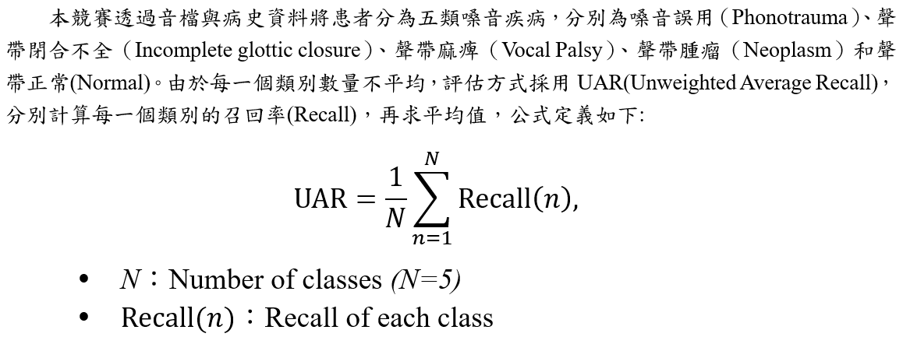
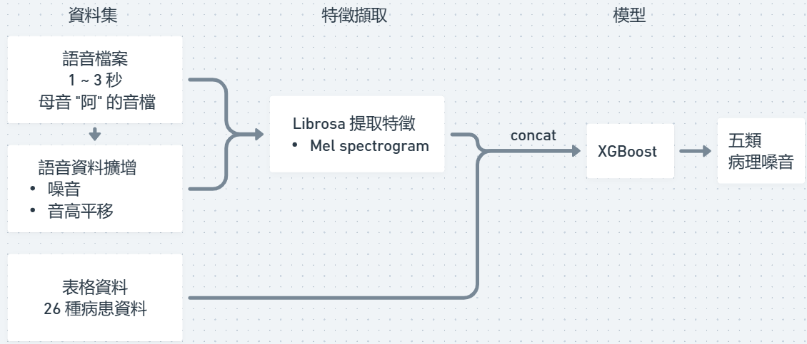

# 2023_tbrain_multimodal-pathology-voice
# TEAM_3410

This is our implementation of this contest: https://tbrain.trendmicro.com.tw/Competitions/Details/27. 
We got rank 5 in the Private Leaderboard and rank 3 in the public Leaderboard.

## Run Our Implementation

### Required libraries

- librosa
- xgboost
- numpy

Required for PANNs implementation:
- pytorch 
- torchlibrosa 
Versions of them are not restricted as long as they're new enough.

### Preprocess
```bash
python3 sort_tabular_data.py
```
* The officially provided csv file should be in `data` dir.
* Output npy file is in the corresponding dataset dir in `data` dir.

### Feature Extraction
```bash
python3 audio_fea_extract.py
```

### Data Augmentation
```bash
python3 data_aug.py
```

* The officially provided wav file directory should be in the corresponding directory in `data`

### Training
#### Single layer XGBoost 
```bash
python3 cv_xgb.py
```
#### Ensemble of PANNs and XGBoost
```bash
python3 ensemble_PANNs_cv_xgb.py
```

### Inference

#### Single layer XGBoost 
```bash
python3 cv_xgb.py -test
```
* `-test`: option for testing both public and private dataset.

#### Ensemble of PANNs and XGBoost
```bash
python3 ensemble_PANNs_cv_xgb.py -test
```
* `n_fold`: number of cross validation folds.

## 簡介
### 問題概述

* 提供資料： 每位病患嗓音的錄音檔以及其 26 項個人相關資料
* 預測目標： 每位病患 ID 所對應的五類嗓音疾病
* 評估標準： UAR (Unweighted Average Recall)


### 執行環境

程式語言為 Python 3，未特別指定版本，使用 miniconda 創建環境；函式庫如本說明前半部份所示，pytorch 僅有 PANNs 相關實驗所使用。

### 特徵截取

官方給出的資料格式，是每位病患的 1~3 秒鐘的錄音以及 26 項病患的相關資料。音檔的部份我們使用的是 mel spectrogram 來取得 128 維的特徵，並將所以特徵統一擷取至最短的長度後，對所有的特徵取中位數。表格資料的部份就直觀的取其數值，缺值補零作為特徵。


### 預測目標

共五個類別，分別代表病患五種不同類型的病理嗓音
### 模型設計與訓練

本次比賽使用的模型架構如下圖，主體為 XGBoost 分類器



訓練方式為 7 folds cross validation，細節參數如下，未提及之參數係依照 xgboost 預設值，未進行修改：
*	n estimators: 210, 
*	max depth: 7, 
*	learning rate: 0.055, 
*	eval metric: mlogloss, 


由此產生出的 7 個模型，我們取用最後一個模型進行預測。

### 預測

預測時會只取最後一個模型的結果，取機率的 argmax 作為預測結果。